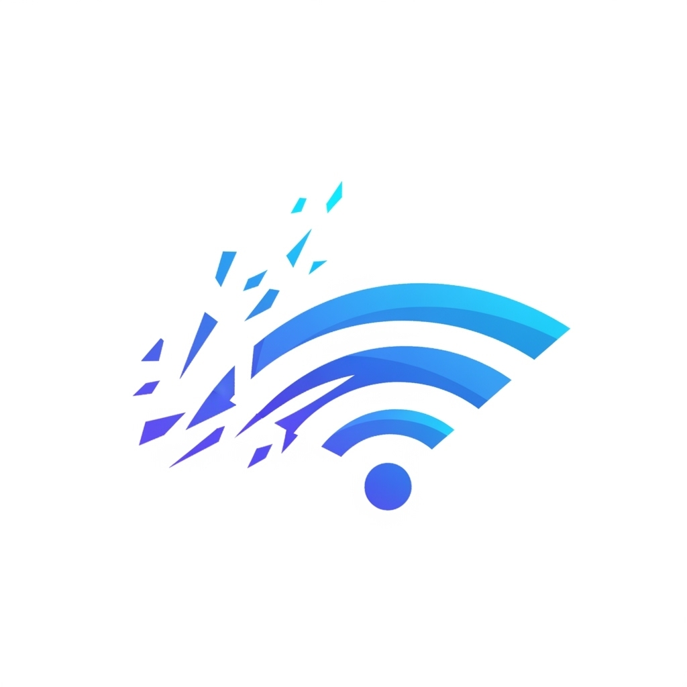
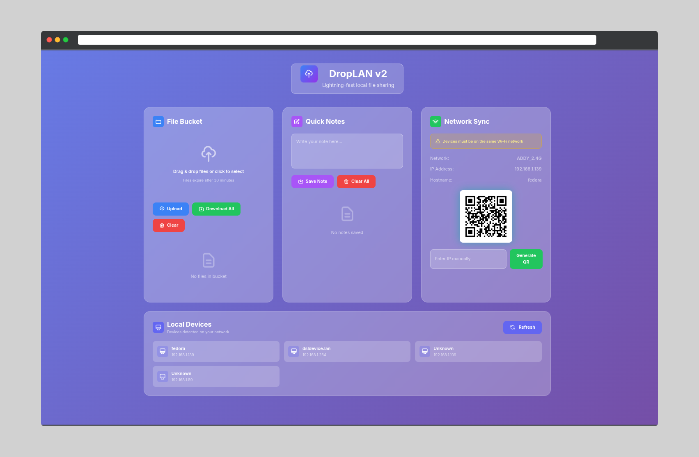

<!-- filepath: /home/addy/DropLAN/README.md -->
<p align="center">
  
</p>

# DropLAN

**A modern, real-time local network file sharing tool with a beautiful web interface**

[](https://python.org)
[](LICENSE)
[](README.md)

## Features

- File Sharing: Drag & drop files to share across devices
- Real-time Notes: Create, edit, and sync notes instantly
- QR Code: Easy device connection via QR code
- Live Sync: WebSocket-powered real-time updates
- Modern UI: Clean, professional interface
- Cross-Platform: Works on any device with a web browser
- Fast Setup: Clone and run in seconds



## Technology Stack

- **Backend**: Flask (Python web framework)
- **Real-time Communication**: Socket.IO with WebSockets
- **Frontend**: Vanilla JavaScript with modern ES6+
- **Styling**: Pure CSS with CSS Grid and Flexbox
- **File Storage**: Local filesystem with SHA256 hashing
- **QR Codes**: Python qrcode library with PIL
- **Server**: Eventlet for production-ready async support
- **Cross-Origin**: Flask-CORS for multi-device access

## Use Cases

- Share photos from your phone to your laptop instantly
- Transfer documents between work devices
- Quick file exchange without USB drives or cloud services

## Quick Start

### Option 1: Docker (Recommended)

```fish
# Clone the repo
git clone https://github.com/Addy-Da-Baddy/DropLAN.git
cd DropLAN

# Install (no auto-launch)
chmod +x install.sh
./install.sh --docker

# Add ~/.local/bin to your PATH if not already (fish shell):
set -U fish_user_paths $HOME/.local/bin $fish_user_paths

# Launch DropLAN (autolaunches browser, shows logs)
droplan
```

> The app will automatically select an open port in the 5000+ range and print it in the logs. Access the web UI at the address shown in your terminal.

### Option 2: Python (Native)

```fish
# Clone the repo
git clone https://github.com/Addy-Da-Baddy/DropLAN.git
cd DropLAN

# Install dependencies
pip3 install --user -r requirements.txt

# Install CLI
chmod +x install.sh
./install.sh --python

# Add ~/.local/bin to your PATH if not already (fish shell):
set -U fish_user_paths $HOME/.local/bin $fish_user_paths

# Launch DropLAN
droplan
```

> The CLI wrapper will always prefer native Python if available, otherwise falls back to Docker.

## Troubleshooting

### "Command not found: droplan"
- Make sure `~/.local/bin` is in your PATH
- For fish shell: `set -U fish_user_paths $HOME/.local/bin $fish_user_paths`
- For bash/zsh: `export PATH="$HOME/.local/bin:$PATH"`
- Reopen your terminal after changing PATH

### "Connection refused" or can't access web UI
- Check if the port is already in use (the script will pick a free port, but check logs)
- Ensure firewall allows connections on the chosen port
- Make sure Docker is running (for Docker installs)
- All devices must be on the same Wi-Fi network

### "Files not appearing" or UI issues
- Refresh the page
- Ensure JavaScript is enabled
- Check terminal logs for errors
- Try restarting DropLAN

### Still stuck?
- Run `droplan help` for command help
- [Report issues](https://github.com/Addy-Da-Baddy/DropLAN/issues)
- [Discussions](https://github.com/Addy-Da-Baddy/DropLAN/discussions)

## Architecture Overview

### Backend Components
- **Flask Application**: Core web server handling HTTP requests
- **Socket.IO Server**: Real-time bidirectional communication
- **File Management**: SHA256-based file storage with automatic cleanup
- **Notes System**: JSON-based persistent note storage
- **Network Discovery**: Automatic IP detection and QR code generation
- **CORS Support**: Cross-origin requests for multi-device access

### Frontend Components
- **Single Page Application**: All functionality in one HTML file
- **Real-time UI**: WebSocket client for live updates
- **Responsive Design**: Mobile and desktop optimized
- **File Upload**: Drag-and-drop with progress indication
- **Notes Editor**: Live editing with conflict resolution

### Security Features
- **Local Network Only**: No external internet dependencies
- **File Expiration**: Automatic cleanup after 30 minutes
- **SHA256 Hashing**: Secure file identification
- **Input Validation**: Server-side validation for all inputs

## Features Overview

### File Bucket
- **Upload**: Drag & drop files or click to select
- **Download**: Download individual files or all at once
- **Auto-expire**: Files automatically expire after 30 minutes
- **Real-time**: See new files instantly across all devices

### Notes App
- **Create**: Write and save notes to the server
- **Edit**: Click edit on any note to modify it
- **Delete**: Remove individual notes or clear all
- **Sync**: All changes appear instantly on connected devices

### Network Sync
- **Auto-detection**: Automatically detects your IP and network
- **QR Code**: Generates QR code for easy device connection
- **Manual IP**: Option to manually enter IP for custom setups

## New Features

- **LAN Device Discovery**: The API `/api/lan-devices` lists active devices on your local network.

## Development

### Local Development Setup

1. **Clone and setup:**
   ```bash
   git clone https://github.com/Addy-Da-Baddy/DropLAN.git
   cd DropLAN
   pip install -r Backend/requirements.txt
   ```

2. **Run in development mode:**
   ```bash
   cd Backend
   python app.py
   ```

3. **Open browser:**
   ```
   http://localhost:5000/LAN_Drop
   ```

### Project Structure
```
DropLAN/
├── droplan/               # Python package
│   ├── backend/          # Flask backend
│   │   ├── app.py        # Main Flask application
│   │   ├── bucket.py     # File management
│   │   ├── notes.py      # Notes management
│   │   └── utils.py      # Utilities (QR codes, etc.)
│   ├── templates/        # Frontend templates
│   │   └── index.html    # Single-page application
│   └── cli.py           # Command-line interface
├── install.sh           # Installation script
├── setup.py            # Python package setup
└── README.md           # This file
```

## Requirements

- **Python**: 3.8 or higher
- **Network**: Wi-Fi connection (all devices on same network)
- **Browser**: Any modern web browser
- **Platform**: Linux, macOS, Windows
- **LAN Device Discovery**: Requires the `ping` command (install with `sudo apt install iputils-ping` on Debian/Ubuntu)

## Dependencies

- `flask` - Web framework
- `flask-cors` - Cross-origin support
- `flask-socketio` - WebSocket support
- `qrcode[pil]` - QR code generation
- `eventlet` - Async server support

## Contributing

1. Fork the repository
2. Create a feature branch: `git checkout -b feature-name`
3. Commit changes: `git commit -am 'Add feature'`
4. Push to branch: `git push origin feature-name`
5. Submit a pull request

## License

This project is licensed under the MIT License - see the [LICENSE](LICENSE) file for details.

## Troubleshooting

### Common Issues

**"Command not found: droplan"**
- Make sure `~/.local/bin` is in your PATH
- For fish shell: `set -U fish_user_paths $HOME/.local/bin $fish_user_paths`
- For bash/zsh: `export PATH="$HOME/.local/bin:$PATH"`
- Reopen your terminal after changing PATH

**"Connection refused" or can't access web UI**
- Check if the port is already in use (the script will pick a free port, but check logs)
- Ensure firewall allows connections on the chosen port
- Make sure Docker is running (for Docker installs)
- All devices must be on the same Wi-Fi network

**"Files not appearing" or UI issues**
- Refresh the page
- Ensure JavaScript is enabled
- Check terminal logs for errors
- Try restarting DropLAN

### Still stuck?
- Run `droplan help` for command help
- [Report issues](https://github.com/Addy-Da-Baddy/DropLAN/issues)
- [Discussions](https://github.com/Addy-Da-Baddy/DropLAN/discussions)

---

**Made with care for seamless local file sharing by Adriteyo Das**
